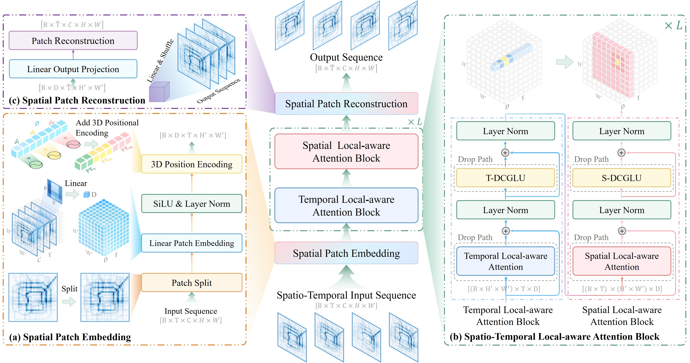
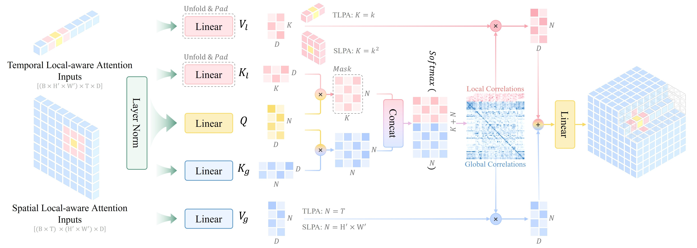

# LaST: A Transformer-Based Network for Spatio-temporal Predictive Learning with Dynamic Local Awareness

This repository contains the training framework, model implementation, configuration files, and checkpoints for our paper, "LaST: A Transformer-based Network for Spatio-Temporal Predictive Learning with Dynamic Local Awareness." The implementation is based on PyTorch and PyTorch Lightning.

- Paper: https://www.sciencedirect.com/science/article/abs/pii/S0950705126004624

English | [简体中文](docs/cn/README_CN.md)

> **All training code, best checkpoints, and configuration files are now available.** Results are fully reproducible on an NVIDIA RTX 4090 using the specified PyTorch, CUDA, and Lightning versions.

> **Due to ongoing graduation and job-search commitments, comprehensive documentation and additional utility scripts will be refined and expanded gradually after the review process is complete to better support the community. Stay tuned!**

> **The core training and validation code has already been uploaded. Additional utilities and documentation will be organized and released progressively after the review process, no later than May 1.**

## Overview

We propose LaST, a Transformer-based network designed specifically for spatio-temporal predictive learning (STPL) that dynamically integrates local awareness into global modeling. At its core is the Spatio-Temporal Local-Aware Attention (STLAA) mechanism, which jointly captures local and global dependencies within a single attention layer by combining parallel local attention (operating on query-centered spatio-temporal windows) with global self-attention, followed by unified softmax normalization for seamless integration. LaST further enhances local feature representation and parameter efficiency through Depthwise Convolutional Gated Linear Units (DCGLU) in the feed-forward network and introduces 3D spatio-temporal positional encoding to preserve structural continuity and mitigate positional insensitivity.

Extensive experiments across six real-world datasets in four domains (traffic forecasting, meteorology, ocean dynamics, and human motion capture) demonstrate LaST's superior performance and efficiency. It achieves consistent MSE reductions—e.g., 5.78% on TaxiBJ, 2.17% on WeatherBench, and 8.69% on sea surface height datasets—while using fewer parameters than competing methods. Comprehensive ablation studies validate the effectiveness and interpretability of each component. Code, training scripts, best checkpoints, and configuration files are provided for full reproducibility.


> Figure: Overall structure of LaST.


> Figure: Detailed architecture of STLAA blocks. Each STLAA block sequentially integrates a TLAAB and SLAAB based on the temporal and spatial dimensions of the input. Both modules adopt a dual-branch structure, consisting of a global attention branch and a local attention branch. The local attention branch operates on $1 \times 3$ temporal windows in TLAAB and $3 \times 3$ spatial neighbourhoods in SLAAB.

## Installation 🎇

### Project Structure

```
LaST/
├── main.py                    # Main entry point for training and evaluation
├── batch_runner.py            # Batch script runner for sequential training tasks
├── pyproject.toml             # Project configuration and dependencies
├── data/                      # Dataset modules and data loaders
├── method/                    # Model implementations
│   ├── __init__.py            # Model factory and setup functions
│   ├── LaST/                  # LaST model implementation
│   ├── PredFormer/            # PredFormer baseline implementation
│   └── DEMO/                  # Demo model template
├── utils/                     # Utility modules and helpers
├── docs/                      # Documentation files
└── LaST_best_checkpoints/     # Model checkpoints
```

### Environment Setup

To ensure full reproducibility of our results, we recommend setting up the environment using one of the methods below. The project uses `pyproject.toml` for dependency management.

We recommend `uv` as the primary method for quick and reliable environment setup.

#### Using uv (Recommended)

`uv` is a fast, modern Python package and project manager developed by Astral, and we recommend using it to quickly set up environments.

##### For Windows:

```bash
# Install uv (if not already installed)
powershell -c "irm https://astral.sh/uv/install.ps1 | iex"

# Sync dependencies and create/activate the virtual environment
uv sync
.\.venv\Scripts\activate
```

##### For Linux and macOS:
```bash
# Install uv (if not already installed)
curl -LsSf https://astral.sh/uv/install.sh | sh

# Sync dependencies and create/activate the virtual environment
uv sync
source .venv/bin/activate
```

---
> **This repository is updated to the current stage of our work. Additional content, including more comprehensive documentation, utility scripts, and refinements, will be actively added once the paper is officially published. Stay tuned! 🚀**
---
**The remaining sections are currently under development.**
---


- Eval

```python
python main.py --eval --ckpt LaST_best_checkpoints/taxi_beijing/best.ckpt --args LaST_best_checkpoints/taxi_beijing/args.yaml
```

# 1. Quick Start 🎇:

## 1.1 Environment

### UV


#### For Windows System:

- Install uv:

```bash
powershell -c "irm https://astral.sh/uv/install.ps1 | iex"
```

- Sync and Activate Environment:

```bash
uv sync
.venv\Scripts\activate
```

#### For Linux and macOS Systems:

- Install uv:

```bash
curl -LsSf https://astral.sh/uv/install.sh | sh
```

- Sync and Activate Environment:

```bash
uv sync
source .venv/bin/activate
```

### Conda & Forge

TODO: 后续更新

```shell
conda create -n LaST python=3.12
conda activate LaST

# Install the required packages
pip install lightning -i https://mirrors.aliyun.com/pypi/simple
# pip install lightning wandb opencv-python torchmetrics torchvision matplotlib rich ipykernel xarray netcdf4 cartopy
# pip install lightning wandb opencv-python torchmetrics torchvision matplotlib rich ipykernel xarray netcdf4 cartopy -i https://mirrors.aliyun.com/pypi/simple

# (Optional) For Jupter Notebook users, you can install the kernel with the following command:
python -m ipykernel install --user --name=last
```

## 1.2 Data Preparation

## 1.3 Inference with Model Checkpoints

## 1.4 Training the Model from Scratch

# 2. Implementation Framework of LaST

Ours Framework (the toolkit for training LaST) is a spatio-temporal modeling and video prediction framework built on the Lightning platform. It is designed for efficient data processing, model construction, result analysis, and visualization. The framework supports a wide range of spatio-temporal prediction tasks, including weather forecasting, video analysis, and traffic flow prediction, among others.

All modules are developed in strict adherence to Lightning's design principles, utilizing Callback functions to enable a modular architecture. This approach ensures simplicity, extensibility, and efficiency, providing researchers and developers with a powerful, flexible solution for spatio-temporal data modeling.

TODO: 这里说明整个框架结构

```text
LaST/


```

# 2. Train 🏋️‍♂️ :


Overview of the datasets employed in our experiments.

## 2.1. Download the dataset 🗂️:

To make it easier for everyone, we have organized and uploaded some commonly used datasets to Google Drive and Baidu Drive. You can directly download these datasets or download them yourself as needed.

The code structure for the data part is as follows:

```text
├── data
│   ├── __init__.py  # If you need to add your own dataset, you need to include it in the data_dict dictionary and the setup_data() function in this file
│   ├── TaxiBJ
│   │   ├── __init__.py
│   │   ├── conf.yaml               # Configuration file containing dataset-related parameters
│   │   ├── dataset.npz             # This is the TaxiBJ dataset file
│   │   └── TaxiBJDataModule.py     # Data processing file
...
```

For a complete explanation of the data module and instructions on **how to train on your own datasets**, [please click here](docs/en/data.md).

<summary>📥 Click to expand full dataset download table</summary>

| Dataset Name                                                            | OneDrive                                                                                     | BaiduNetDisk                                                      | Description                                               |
| ----------------------------------------------------------------------- | -------------------------------------------------------------------------------------------- | ----------------------------------------------------------------- | --------------------------------------------------------- |
| [TaxiBJ](https://github.com/TolicWang/DeepST/tree/master/data/TaxiBJ)      | [Download](https://1drv.ms/u/c/b756f405097b8e82/ETbnKFeKkNVDjOB5UwtXn_0BXR_VoNS3_2uPPcJbcopvyg) | [Download](https://pan.baidu.com/s/1VDHPuy61GGwqt05t4NVH8A?pwd=iSHU) | `data/TaxiBJ/dataset.npz`                               |
| [Weather Bench](https://github.com/pangeo-data/WeatherBench)(T2m, Tcc, Rl) | [Download](https://1drv.ms/u/c/b756f405097b8e82/ETbnKFeKkNVDjOB5UwtXn_0BXR_VoNS3_2uPPcJbcopvyg) | [Download](https://pan.baidu.com/s/1Wa1S2qjV0fAb0bWlMswnYg?pwd=iSHU) | `data/WeatherBench/5_625/2_temperature/{xxx}.nc`        |
| [Human3.6M](http://vision.imar.ro/human3.6m/description.php)               | [Download](https://1drv.ms/f/c/b756f405097b8e82/Ep1YpOl6MhFBi0vEZ7zGKJQB9u7rssMvxgob4kTizr36CQ) | [Download](https://pan.baidu.com/s/1Rt69aYiugVPQci9YJK25Tg?pwd=iSHU) | `data/Human/images`&`data/Human/images_txt`           |
| [CORAv2.0](https://mds.nmdis.org.cn/)                                      | -                                                                                            | -                                                                 | Please apply for the dataset at https://mds.nmdis.org.cn. |

## 2.3. Training 🏋️‍♂️:

We provide two main methods for training your model, along with a script example for sequential training:

### ✅ Method 1: Prepare Configuration Files

### ✅ Method 2: Use Command-Line Arguments

### 🔁 Sequential Training Script

# Acknowledgements & References 🔗:

1. 🫡 Our overall training framework is largely inspired by [OpenSTL](https://github.com/chengtan9907/OpenSTL), which we adapted and refactored to better align with the standard PyTorch Lightning usage paradigm.
2. 🫡 Our core ideas are also significantly influenced by [PredFormer](https://arxiv.org/abs/2410.04733).

# Citation 📚:

If you find this repository useful, please consider citing our paper (citation to be updated upon publication):

```bibtex
@ARTICLE{Liu2025LaST,
    title = {LaST: A Transformer-based Network for Spatio-Temporal Predictive Learning with Dynamic Local Awareness},
    author = {Zijian Liu, Yehao Wang, Zhuolin Li, Jie Yu, Chengci Wang, Zhiyu Liu, Shuai Zhang and Lingyu Xu},
    booktitile = {},
    note = {Under review},
    year={2025}
}
```

---

If you spot any issues or have improvement ideas, we sincerely appreciate you opening an issue or submitting a pull request😊.

受学识所限，如您发现任何问题或有改进建议，恳请在Issues中提出或直接提交Pull Request，我们将不胜感激并第一时间处理😊。
