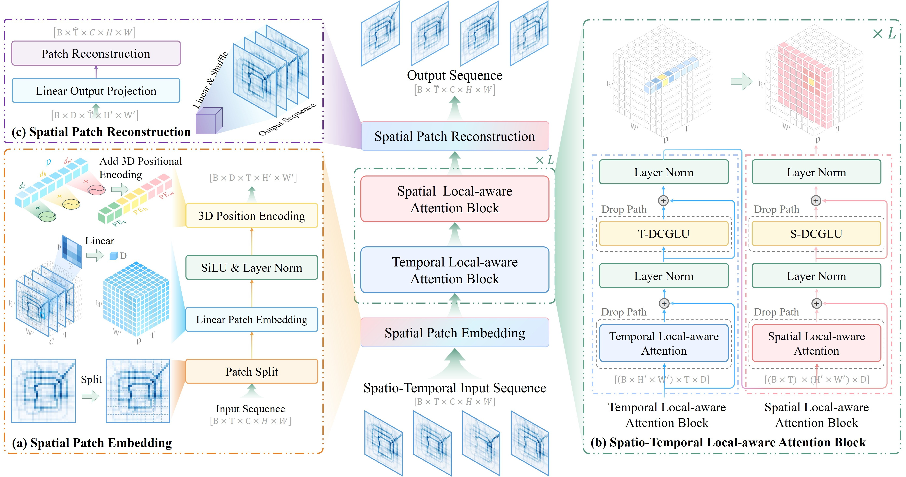
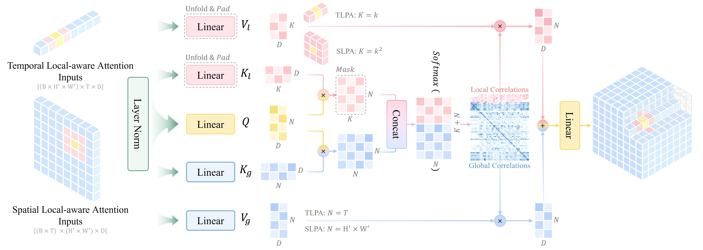
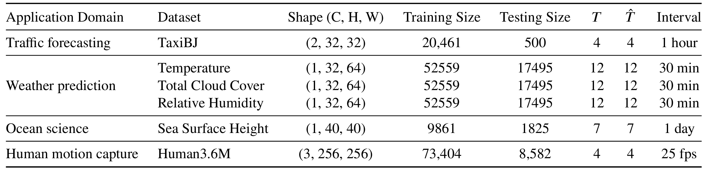

# LaST：面向时空预测的动态局部感知 Transformer 网络

本仓库包含 **LaST** 的官方 PyTorch 与 PyTorch Lightning 实现，以及训练配置和预训练检查点。

- **论文：** [LaST: A transformer-based network for spatio-temporal predictive learning with dynamic local awareness](https://www.sciencedirect.com/science/article/pii/S0950705126004624)
- **语言：** 简体中文 | [English](../../README.md)


## 项目简介

LaST 是一个面向时空预测学习（STPL）的 Transformer 网络。其核心时空局部感知注意力（STLAA）机制在单个注意力层中结合以查询为中心的局部注意力和全局自注意力。LaST 还使用深度卷积门控线性单元（DCGLU）和三维时空位置编码，以增强局部特征建模并保留时空结构。

实验覆盖交通预测、气象、海洋动力学和人体运动捕捉四个领域的六个数据集。LaST 在减少参数量的同时取得了稳定的性能提升，完整实验结果和消融分析请参见论文。



*LaST 整体结构。*



*每个 STLAA 模块依次集成时序局部感知注意力模块（TLAAB）和空间局部感知注意力模块（SLAAB），其局部分支分别使用 $1 \times 3$ 时序窗口和 $3 \times 3$ 空间邻域。*

## 环境安装

项目需要 Python 3.12 或更高版本，并通过 `pyproject.toml` 和 `uv.lock` 管理依赖。

### Windows

```powershell
powershell -c "irm https://astral.sh/uv/install.ps1 | iex"
uv sync
.\.venv\Scripts\activate
```

### Linux 与 macOS

```bash
curl -LsSf https://astral.sh/uv/install.sh | sh
uv sync
source .venv/bin/activate
```

## 数据准备



数据集模块和配置文件位于 `data/` 目录。数据接口及自定义数据集的接入方法请参见[数据模块文档](data.md)。

| 数据集 | Google Drive | 百度网盘 | 存放位置 |
| --- | --- | --- | --- |
| [TaxiBJ](https://github.com/TolicWang/DeepST/tree/master/data/TaxiBJ) | [下载](https://drive.google.com/file/d/1HDN_hF2pOP2JT97kB8VCREIfe5Z22Co-/view?usp=sharing) | [下载](https://pan.baidu.com/s/1VDHPuy61GGwqt05t4NVH8A?pwd=iSHU) | `data/TaxiBJ/dataset.npz` |
| [WeatherBench](https://github.com/pangeo-data/WeatherBench)（T2m、Tcc、Rl） | [下载](https://drive.google.com/file/d/1wxIXK-1vZ9tST_5xB3Ph3QpVB6Q9YhB1/view?usp=sharing) | [下载](https://pan.baidu.com/s/1Wa1S2qjV0fAb0bWlMswnYg?pwd=iSHU) | `data/WeatherBench/5_625/2_temperature/{xxx}.nc` |
| [Human3.6M](http://vision.imar.ro/human3.6m/description.php) | [下载](https://drive.google.com/file/d/1jwrXUO6eBh8689NJO8WYoeNMwXtoUD8t/view?usp=sharing) | [下载](https://pan.baidu.com/s/1x78V54ueiW3Iz2CgMOb6zA?pwd=iSHU) | `data/Human/images` 和 `data/Human/images_txt` |
| [CORAv2.0](https://mds.nmdis.org.cn/) | - | - | 请向数据集提供方申请下载。 |

## 使用方法

使用数据集配置训练 LaST：

```bash
python main.py --conf TaxiBJ
```

也可以使用已有实验配置：

```bash
python main.py --args path/to/args.yaml
```

使用预训练检查点评估模型：

```bash
python main.py --eval \
  --ckpt LaST_best_checkpoints/taxi_beijing/best.ckpt \
  --args LaST_best_checkpoints/taxi_beijing/args.yaml
```

运行 `python main.py --help` 可查看全部命令行参数。

## 项目结构

```text
LaST/
├── main.py                    # 训练与评估入口
├── batch_runner.py            # 顺序实验脚本
├── pyproject.toml             # 项目配置与依赖
├── data/                      # 数据集模块与数据加载器
├── method/                    # LaST 与基线模型实现
├── utils/                     # 训练工具与回调函数
├── docs/                      # 文档与图片
└── LaST_best_checkpoints/     # 预训练检查点与配置
```

## 致谢

本项目的训练框架参考了 [OpenSTL](https://github.com/chengtan9907/OpenSTL)，并根据 PyTorch Lightning 的设计进行了调整。模型设计也受到 [PredFormer](https://arxiv.org/abs/2410.04733) 的启发。

## 论文引用

如果本仓库对您的研究有帮助，欢迎引用：

```bibtex
@article{Liu2026LaST,
  title   = {LaST: A Transformer-based Network for Spatio-Temporal Predictive Learning with Dynamic Local Awareness},
  author  = {Zijian Liu and Yehao Wang and Zhuolin Li and Jie Yu and Chengci Wang and Zhiyu Liu and Shuai Zhang and Lingyu Xu},
  journal = {Knowledge-Based Systems},
  volume  = {340},
  pages   = {115722},
  year    = {2026},
  doi     = {10.1016/j.knosys.2026.115722}
}
```

## 开源协议

本项目采用 [MIT License](../../LICENSE)。
